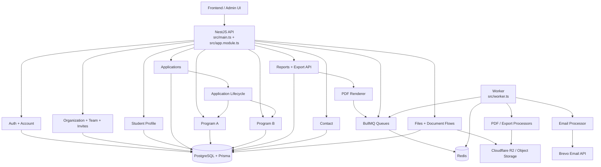

# NTI Backend

NTI Backend is a NestJS API for the NTI platform. The service uses PostgreSQL for persistence, Redis and BullMQ for background jobs, Prisma for data access, Fastify for HTTP, Swagger for API docs, and Puppeteer-based rendering for PDF/export workflows.

## Overview

The codebase currently covers these major areas:

- `auth`: registration, login, refresh/logout, email confirmation, password reset, forced password change, and invite-based onboarding
- `account`: authenticated account operations such as password and email change flows
- `admin`: admin APIs for users, organizations, system invites, and academic structure
- `organization`: organization profile, membership, invitations, access control, and organization documents
- `team`: team lifecycle, membership, leadership transfer, and team invitations
- `student-profile`: student profile data plus academic structure lookup APIs
- `applications`: application lifecycle, calls, sections, evaluations, needs-info threads, eligibility signals, and document completeness
- `programs/program-a`: mentorship and milestone support for mentored applications
- `programs/program-b`: backlog, team application, company overview, and project execution flows
- `reports`: dashboards, exports, audit data, and async PDF/export jobs
- `contact`: contact form submissions
- `files`: presigned uploads/downloads and upload tracking
- `invites`: invite validation endpoints
- `infrastructure`: config, database, logging, mail, queueing, storage, hashing, and PDF support
- `worker`: BullMQ worker entrypoint for async processors

If you are new to the codebase, start with:

1. `src/main.ts` for bootstrap, global validation, CORS, cookies, and Swagger
2. `src/app.module.ts` for the active module graph
3. `prisma/schema.prisma` for the domain model
4. `src/app.controller.ts` for health endpoints

## Backend Flow Diagram



## Prerequisites

- Node.js 22+
- npm
- Docker and Docker Compose
- PostgreSQL and Redis if you run the app outside Compose

## Environment Setup

Create a local environment file from the example:

```bash
cp .env.example .env
```

Important variables:

| Variable | Purpose |
| --- | --- |
| `PORT` | HTTP port for the API |
| `NODE_ENV` | Nest/Node runtime mode |
| `APP_ENV` | Cookie/CORS behavior profile (`local`, `development`, `staging`, `production`, `test`) |
| `RUN_QUEUE_PROCESSORS` | Enables in-process queue processors inside the API app |
| `DATABASE_URL` | PostgreSQL connection string used by Prisma and seeds |
| `CORS_ORIGINS` | Comma-separated list of allowed frontend origins; wildcard patterns are supported |
| `REDIS_HOST` / `REDIS_PORT` | Redis connection used by BullMQ |
| `BREVO_API_KEY` / `EMAIL_FROM` | Outbound email delivery configuration |
| `EMAIL_LOGO_URL` | Optional absolute public logo URL rendered in emails |
| `FRONTEND_URL` | Frontend base URL used in generated links |
| `R2_*` | Cloudflare R2 object storage configuration |
| `FILE_UPLOAD_*` | Presigned upload expiry, size limits, MIME allowlist, and upload verification |
| `FILE_DOWNLOAD_PRESIGN_EXPIRES_SECONDS` | Presigned download lifetime for private file access |
| `ORGANIZATION_DOCUMENT_*` | Upload policy for organization documents |
| `PUPPETEER_*` | Browser executable, headless mode, and timeout for PDF/export rendering |
| `PDF_JOB_WAIT_TIMEOUT_MS` / `PDF_WORKER_CONCURRENCY` | Queue-backed PDF/export job behavior |
| `JWT_*` | Access, refresh, and forced-password-change token secrets and expirations |
| `ARGON2_TIME_COST` | Password hashing cost used by auth and seed scripts |
| `TOKEN_BYTE_LENGTH` | Random token entropy for auth/invite flows |
| `EMAIL_VERIFICATION_EXPIRATION_HOURS` | Email confirmation token lifetime |
| `DEV_EMAIL_VERIFICATION_BYPASS_*` | Local-only bypass for email verification flows |
| `FORCE_PASSWORD_CHANGE_TOKEN_EXPIRATION_MINUTES` | Forced password change token lifetime |
| `PASSWORD_RESET_EXPIRATION_MINUTES` | Password reset token lifetime |
| `SYSTEM_INVITATION_EXPIRATION_HOURS` | System invitation token lifetime |
| `ORGANIZATION_INVITATION_EXPIRATION_DAYS` | Organization invitation token lifetime |
| `SUPERADMIN_TEMP_PASSWORD` | Temporary password for seeded superadmin account |

The authoritative schema for supported variables is `src/infrastructure/config/env.schema.ts`. `.env.example` covers the common local setup but is not the canonical source for every optional key.

## Running Locally

### Docker Compose

Compose builds the `dev` target from the single multi-stage `Dockerfile` and starts:

- `app`: Nest API on `http://localhost:3001`
- `postgres`: PostgreSQL 16 on `localhost:5432`
- `redis`: Redis 7 on `localhost:6379`

Run it with:

```bash
docker compose up
```

Important behavior:

- the `app` service runs `prisma migrate deploy` before `npm run start:dev`
- the `app` service sets `RUN_QUEUE_PROCESSORS=true`, so email/PDF/export processors run in-process by default
- the separate `worker` Compose service exists, but it is optional and only starts when you enable the `worker` profile

To start the dedicated worker locally:

```bash
docker compose --profile worker up
```

### Manual Setup

If you want to run the app without Compose, start PostgreSQL and Redis first, then:

```bash
npm install
npm run prisma:generate
npm run prisma:migrate
npm run start:dev
```

Run the worker in a second terminal only when you want dedicated queue processing outside the API process:

```bash
npm run start:worker:dev
```

If you keep `RUN_QUEUE_PROCESSORS=false`, async jobs require the worker process.

## Health and API Docs

- health endpoints: `GET /` and `GET /health`
- REST prefix: `/api/v1`
- Swagger UI: `http://localhost:3001/api/docs`

Swagger is configured for:

- bearer-token fallback auth
- `accessToken` cookie auth
- `refreshToken` cookie auth
- `requiresPasswordChangeToken` cookie auth

## Common Workflows

### Authentication

The auth/account stack supports:

- standard registration and login
- company-owner registration
- invite-based registration
- email confirmation and resend
- access token refresh through HttpOnly cookies
- logout and refresh-token revocation
- forgotten password and password reset
- forced password change for privileged accounts
- authenticated password and email change flows

Operational details:

- access tokens are primarily transported in the HttpOnly `accessToken` cookie
- refresh tokens are stored in the HttpOnly `refreshToken` cookie
- forced password changes use `requiresPasswordChangeToken`
- `APP_ENV=local` uses local-friendly cookie policy
- deployed environments use cross-site secure cookie policy
- frontend requests must use credentials and come from allowed `CORS_ORIGINS`

### Applications and Programs

The current domain goes beyond auth/org/team management:

- application calls can be managed by admins and queried publicly
- applications support sections, history, evaluations, decisions, mentorship assignments, needs-info threads, and document tracking
- Program A includes mentored application support plus milestones and mentorship notes
- Program B includes backlog intake, team applications, company overview, project execution, mentoring, milestones, rewards, and project documents

Supporting docs in `docs/` include `PROGRAM_A_STATUS_MAP.md` and `DEV_FIXTURES.md`.

### Files and Documents

File handling is built around presigned URLs rather than streaming file bodies through the API.

- `POST /api/v1/files/upload-url` creates an upload record and returns a presigned upload URL
- `POST /api/v1/files/complete` marks the upload as finished
- `GET /api/v1/files/:id/download-url` returns a public URL or a presigned private download URL

There are also dedicated organization/program document flows built on top of the same storage infrastructure.

### Background Jobs and PDF/Export Rendering

BullMQ and Redis handle asynchronous work such as:

- email delivery
- PDF rendering
- report export jobs

Relevant code lives in:

- `src/infrastructure/queue`
- `src/infrastructure/queue/processors`
- `src/infrastructure/pdf`
- `src/reports/report-export`
- `src/worker.ts`

## Database and Prisma

Prisma is used for schema management and database access.

- Generate the client: `npm run prisma:generate`
- Create/apply local migrations: `npm run prisma:migrate`
- Apply migrations in deployment: `npm run prisma:migrate:deploy`
- Open Prisma Studio: `npm run prisma:studio`
- Reset the local database: `npm run prisma:reset`
- Run baseline seed data: `npm run prisma:seed`
- Run extended dev fixtures: `npm run seed:dev`

The Prisma schema, migrations, and seed scripts live in `prisma/`.

### Seed Behavior

`npm run prisma:seed` currently runs:

- `001-superadmin.seed.ts`
- `002-calls.seed.ts`

`npm run seed:dev` additionally runs:

- `003-program-b-backlog.seed.ts`
- `004-dev-fixtures.seed.ts`

The seed pipeline requires:

- `DATABASE_URL`
- `SUPERADMIN_TEMP_PASSWORD`
- a valid `ARGON2_TIME_COST`

## Available Scripts

```bash
npm run build
npm run format
npm run start
npm run start:dev
npm run start:debug
npm run start:prod
npm run start:worker
npm run start:worker:dev
npm run lint
npm run lint:staged
npm run typescript
npm run test
npm run test:watch
npm run test:cov
npm run test:debug
npm run test:e2e
npm run prisma:generate
npm run prisma:migrate
npm run prisma:migrate:deploy
npm run prisma:studio
npm run prisma:reset
npm run prisma:seed
npm run seed:dev
```

## Code Quality

- ESLint handles linting
- Prettier handles formatting
- TypeScript checks run through `npm run typescript`
- Husky, lint-staged, and Commitlint are configured for contributor workflow support

## Repository Structure

```text
src/
  account/           authenticated account operations
  admin/             admin APIs
  applications/      application lifecycle and calls
  auth/              authentication and onboarding
  contact/           contact submissions
  files/             upload/download record management
  infrastructure/    shared technical modules
  organization/      organization and org documents
  programs/          program A and program B flows
  reports/           dashboards, audits, exports
  student-profile/   student profile and academic structure
  team/              team membership and invites
prisma/              schema, migrations, and seed tasks
docs/                supporting project documentation
test/                end-to-end tests
```

## Notes for Contributors

- `src/main.ts` is the canonical place for app-level middleware, validation, CORS, cookies, and API docs setup
- `src/app.module.ts` shows which modules are active in the API process
- `RUN_QUEUE_PROCESSORS` determines whether processors run inside the API process
- when adding or changing a public endpoint, update the matching Swagger decorators and tests together
- when changing auth, storage, or reporting flows, also inspect the related repositories and queue processors

## Production Deployment

The repository ships a single multi-stage `Dockerfile` with these targets:

- `dev`
- `worker`
- `production`

Default `docker build .` uses the final `production` stage for the API. The worker is built from the same Dockerfile with `--target worker`; there is no separate `Dockerfile.worker` in the repository.

### Render

If you deploy queue-backed email/PDF/export jobs separately, provision:

- one web service for the API
- one background worker built from `Dockerfile` target `worker`
- one Redis instance

Notes:

- the API production container runs Prisma migrations on startup
- API and worker must point to the same PostgreSQL and Redis instances
- both runtimes need the required app config from `src/infrastructure/config/env.schema.ts`
- Puppeteer/Chromium settings must be present anywhere PDF/export rendering is expected
